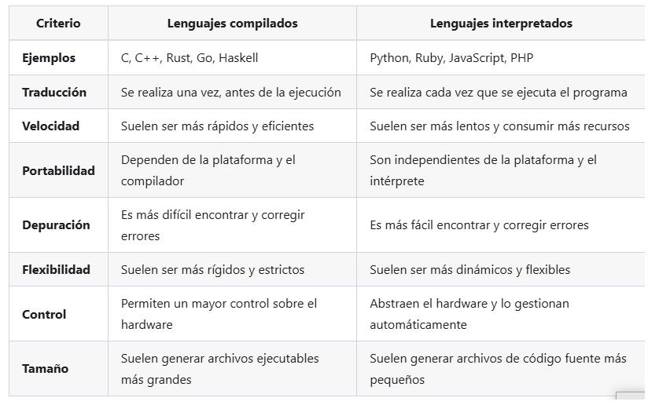
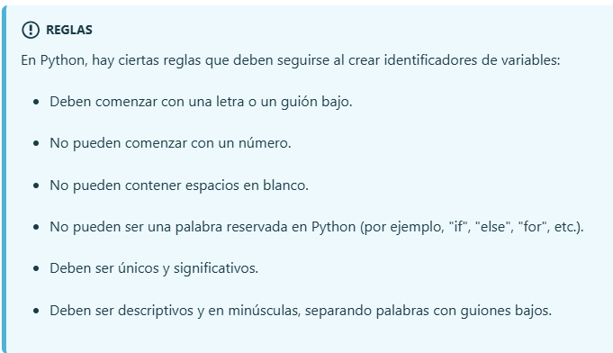

<!-- No borrar o modificar -->
[Inicio](./index.md)


# Semana 2

## Python

Python es un lenguaje de programación de alto nivel, de propósito general, que fue creado por Guido van Rossum en el año 1989. Es un lenguaje intuitivo, fácil de aprender y con una sintaxis clara y legible, que lo hace accesible tanto para principiantes como para programadores experimentados.

Python se utiliza ampliamente en una gran variedad de aplicaciones, desde el desarrollo de aplicaciones web hasta la automatización de tareas, el análisis de datos y la inteligencia artificial. También es muy popular en la comunidad científica y en la investigación, gracias a la gran cantidad de bibliotecas y herramientas disponibles que lo hacen muy útil para el cálculo y la visualización de datos.

Además de ser fácil de aprender y de utilizar, Python también es un lenguaje de código abierto, lo que significa que está disponible gratuitamente y que hay una gran comunidad de desarrolladores que contribuyen a su desarrollo y mejora.


## Python - Lenguaje interpretado

Python es un lenguaje de programación interpretado de alto nivel. Esto significa que no se traduce a código de máquina antes de ejecutarse. En su lugar, se ejecuta línea por línea por un intérprete. Este proceso de interpretación puede ser más lento que la ejecución de código compilado, pero tiene algunas ventajas. Por ejemplo, los programas interpretados pueden ser más fáciles de depurar y depurar. También pueden ser portables a diferentes plataformas, ya que no necesitan ser compilados para cada plataforma específica.

Para crear la tabla anterior en markdown, puedes usar el siguiente código:

## Tabla comparativa: Lenguajes compilados vs. Lenguajes interpretados

Tabla HTML: Lenguajes Compilados vs. Lenguajes Interpretados Criterio Lenguajes compilados Lenguajes interpretados Ejemplos C, C++, Rust, Go, Haskell Python, Ruby, JavaScript, PHP Traducción Se realiza una vez, antes de la ejecución Se realiza cada vez que se ejecuta el programa Velocidad Suelen ser más rápidos y eficientes Suelen ser más lentos y consumir más recursos Portabilidad Dependen de la plataforma y el compilador Son independientes de la plataforma y el intérprete Depuración Es más difícil encontrar y corregir errores Es más fácil encontrar y corregir errores Flexibilidad Suelen ser más rígidos y estrictos Suelen ser más dinámicos y flexibles Control Permiten un mayor control sobre el hardware Abstraen el hardware y lo gestionan automáticamente Tamaño Suelen generar archivos ejecutables más grandes Suelen generar archivos de código fuente más pequeños.



## Instalación de Python

La instalación de Python depende del sistema operativo que esté utilizando. Aquí se describen los pasos para instalar Python en los sistemas operativos más comunes:

- Windows: Descargue el instalador de Python desde el sitio web oficial de Python (https://www.python.org/downloads/). Ejecute el instalador y siga las instrucciones en pantalla para instalar Python en su computadora. Verifique que Python está instalado correctamente abriendo el símbolo del sistema y escribiendo python y presionando Enter.

- macOS: Descargue el instalador de Python desde el sitio web oficial de Python (https://www.python.org/downloads/). Ejecute el instalador y siga las instrucciones en pantalla para instalar Python en su computadora. Verifique que Python está instalado correctamente abriendo la terminal y escribiendo python y presionando Enter.

- Linux: La mayoría de las distribuciones de Linux ya vienen con Python preinstalado. Para verificar si Python está instalado, abra una terminal y escriba python y presione Enter.

Si no está instalado, puede instalar Python desde los repositorios de software de su distribución de Linux. Por ejemplo, en Ubuntu, puede instalar Python escribiendo sudo apt-get install python en una terminal. Una vez que Python esté instalado, puede comenzar a escribir y ejecutar programas en Python utilizando un editor de texto o un entorno de desarrollo integrado (IDE). Hay muchas opciones disponibles, incluyendo IDLE (incluido con la instalación de Python), PyCharm, Visual Studio Code,

## Sangrado en Python

Sangrado (o indentación) es un espacio en blanco al comienzo de una línea de código que se usa para resaltar la estructura y la organización del código. El sangrado hace que el código sea más legible visualmente agrupando líneas relacionadas.

Es una forma de organizar visualmente el código para facilitar su lectura. Se utilizan espacios o tabs para "sangrar" (indentar) determinadas líneas de código.

Python requiere sangrado de forma estricta, de tal manera que el sangrado indica la estructura y bloques de código. Por ejemplo:

```

if condition:
    print("Verdadero")
else:
    print("Falso")

```

Aquí el sangrado indica que la línea print("Verdadero") está dentro del bloque if, mientras que la línea print("Falso") está dentro del bloque else.

Otro ejemplo:

```
for i in  range(5):
 print(i)

```

La línea print(i) está sangrada debajo del bucle for, indicando que se ejecutará en cada iteración.

Algunos puntos sobre el sangrado en Python:

Es obligatorio. Python usa el sangrado para determinar la estructura del código.

Es estricto. El sangrado debe ser consistente dentro de un bloque, usar espacios no tabs.

Se recomiendan 4 espacios, aunque Python también acepta tabs.

No puede mezclar espacios y tabs dentro de un bloque.

El sangrado hace que el código Python sea más legible visualmente, ayudando a agrupar líneas relacionadas y resaltando la estructura anidada. Por eso es una parte importante del estilo de codificación en Python.

## Variables en python

En Python, las variables son usadas para almacenar información y pueden ser referenciadas por un nombre.

Para crear una variable en Python, simplemente asignamos un valor a un nombre. Por ejemplo:

```
nombre = "Juan"
edad = 25
print("Mi nombre es", nombre)
print("Tengo", edad, "años")

```



```
#Identificadores válidos
nombre = "Juan"
edad = 25
_nombre_completo = "Juan Pérez"
#Identificadores inválidos
123nombre = "Juan" # Comienza con un número
nombre-completo = "Juan Pérez" # Contiene un guión
if = "condicional" # Es una palabra reservada

```

## Snake case

El snake case es una convención de nomenclatura muy utilizada en Python para nombrar variables, funciones y módulos. Aquí tienes una explicación más detallada:

Definición: Snake case consiste en escribir palabras en minúsculas, separándolas con guiones bajos (_).
Uso en Python:
Variables: mi_variable, contador, nombre_usuario
Funciones: calcular_promedio(), obtener_datos(), imprimir_resultado()
Módulos: utilidades.py, procesamiento_datos.py
Ejemplos:

```
# Variables
numero_de_usuarios = 100
nombre_completo = "Juan Pérez"

# Función
def calcular_area_rectangulo(largo, ancho):
    return largo * ancho

# Llamada a función
area = calcular_area_rectangulo(5, 3)

# En una clase
class ProcesadorTexto:
    def __init__(self):
        self.texto_actual = ""

    def contar_palabras(self):
        return len(self.texto_actual.split())

```

Ventajas:

- Mejora la legibilidad del código
- Es consistente con la filosofía de Python de código    explícito y claro
- Facilita la distinción entre variables/funciones y clases (que usan PascalCase)

- Cuándo no usar snake case:

- Nombres de clases (usar PascalCase)
- Constantes (usar MAYÚSCULAS_CON_GUIONES_BAJOS)

- Consideraciones:

- Evitar nombres de una sola letra, excepto para contadores o índices muy simples
- Usar nombres descriptivos pero no excesivamente largos

## Constantes en Python

Las constantes en Python son un concepto un poco diferente comparado con otros lenguajes de programación.

Convención de nombrado:
Se escriben en MAYÚSCULAS_CON_GUIONES_BAJOS
Ejemplo: MAX_VALUE, PI, DEFAULT_CONFIG
Declaración: En Python, técnicamente no existen constantes "verdaderas". Se usan variables regulares, pero por convención, se tratan como constantes.

```
x = 5 # número entero
y = 5.0 # número flotante
z = 3 + 4j # número complejo

```
##
## Tipos de datos en python

En Python, existen diferentes tipos de datos que se pueden utilizar para almacenar información. Aquí hay algunos de los tipos de datos más comunes:

1. Números: Python tiene soporte para números enteros (int), números flotantes (float) y números complejos (complex). Por ejemplo:


```
x = 5 # número entero
y = 5.0 # número flotante
z = 3 + 4j # número complejo

```

2. Cadenas: Las cadenas en Python se usan para representar texto y se escriben entre comillas simples o dobles. Por ejemplo:

```
nombre = "John Doe"
apellido = 'Smith'

```

3. Listas: Las listas en Python son secuencias ordenadas de valores, que pueden ser de cualquier tipo de datos. Por ejemplo:


```
frutas = ["manzana", "banana", "pera"]
numeros = [1, 2, 3, 4, 5]

```

4. Tuplas: Las tuplas son similares a las listas, pero son inmutables y no se pueden modificar una vez creadas. Por ejemplo:


```
colores = ("rojo", "verde", "azul")

```

5. Diccionarios: Los diccionarios en Python son estructuras de datos no ordenadas que asocian claves con valores. Por ejemplo:

```
persona = {
 "nombre": "John Doe",
 "edad": 30,
 "ciudad": "New York"
}

```

## Comentarios en python

Los comentarios en Python son líneas de texto que se utilizan para describir el código y ayudar a otros programadores a comprenderlo. Los comentarios no son interpretados por Python y no tienen ningún impacto en el funcionamiento del programa.

Hay dos maneras de crear comentarios en Python:

1. Usando el carácter #:

```
# Este es un comentario en una sola línea
x = 5 # Este es un comentario en la misma línea que el código

```

2. Usando tres comillas dobles:

```
"""
Este es un comentario
en varias líneas

"""

```

## La función print() de Python

La función print() en Python es una herramienta fundamental para mostrar información en la pantalla. Es una función integrada que se utiliza para imprimir cadenas de texto, variables, valores y otras expresiones.

Sintaxis básica:

```
print(objeto)

```

Parámetros:

  - objeto: Puede ser una cadena de texto (entre  comillas simples o dobles), una variable, una expresión, un objeto, etc.

Ejemplos:

```
# Imprimir una cadena de texto
print("Hola mundo!")
# Imprimir una variable
nombre = "Ana"
print(nombre)
# Imprimir una expresión
suma = 1 + 2
print(suma)
# Imprimir múltiples objetos
print("El resultado es:", suma, "y el nombre es:", nombre)

```

Opciones adicionales:

  - Separador: Se puede usar el argumento sep para especificar el separador entre los objetos que se imprimen. El valor por defecto es un espacio.

 ```
print("a", "b", "c", sep=", ")

``` 

Salida:

```
a, b, c

``` 
-   Fin de línea: El argumento end define el carácter que se imprime al final de la salida. El valor por defecto es un salto de línea (\n).

```
print("Primera línea", end=" ")
print("Segunda línea")

``` 

Salida:

```
Primera línea Segunda línea

``` 

- Formateo de cadenas f: Python 3.6 introdujo las cadenas f, que permiten formatear cadenas de forma más elegante.

```
edad = 25
print(f"Hola, me llamo {nombre} y tengo {edad} años.")

``` 

Salida:

```
Hola, me llamo Ana y tengo 25 años.

``` 


## La función input() en Python

La función input() en Python es indispensable para interactuar con el usuario y obtener información que introduzca por teclado.

Sintaxis:

```
entrada = input(prompt)

``` 

Parámetros:

- prompt (opcional): Es una cadena de texto que se muestra al usuario antes de que introduzca la información. Esta cadena sirve para guiar al usuario sobre qué tipo de información se espera.

Retorno:

La función input() siempre devuelve un string, incluso si el usuario introduce un número. Esto significa que si necesita trabajar con la información como un número, deberá convertirla explícitamente usando funciones como int(), float(), etc.

Ejemplos:

```
# Pedir el nombre del usuario
nombre = input("¿Cómo te llamas? ")
print(f"Hola, {nombre}!")
# Solicitar dos números y sumarlos
num1 = int(input("Introduce el primer número: "))
num2 = int(input("Introduce el segundo número: "))
suma = num1 + num2
print(f"La suma es: {suma}")

``` 

Puntos a tener en cuenta:

  La función input() siempre espera que el usuario pulse la tecla Enter para finalizar la entrada.

  Si no se proporciona un prompt, la función muestra un mensaje genérico como Introduce un valor:.

  Se recomienda usar el prompt para guiar al usuario y evitar confusiones.

  Para procesar la entrada como un tipo de dato específico, use funciones de conversión como int(), float(), etc.

  ## Estructuras de control condicionales

Los condicionales en Python permiten ejecutar código solo si se cumple una determinada condición. Esto es muy útil para controlar el flujo de un programa y tomar decisiones basadas en diferentes situaciones.

### La estructura if

La estructura if es la estructura condicional más básica en Python. Se utiliza para evaluar una condición y ejecutar un bloque de código si la condición es verdadera.

La sintaxis de la estructura if es la siguiente:

```
edad = 18
if edad >= 18:
 print("Eres mayor de edad")

``` 

### La estructura elif

La estructura elif se utiliza para agregar condiciones adicionales a una estructura if. Se evalúan secuencialmente, y el bloque de código correspondiente a la primera condición que se cumple se ejecuta.

La sintaxis de la estructura elif es la siguiente:

```
if condición 1:
# Bloque de código que se ejecuta si la condición 1 es verdadera
elif condición 2:
# Bloque de código que se ejecuta si la condición 2 es verdadera

``` 
Por ejemplo, el siguiente código imprime el mensaje "Eres mayor de edad", "Eres adolescente" o "Eres menor de edad", dependiendo de la edad del usuario:

``` 
edad = 17
if edad >= 18:
 print("Eres mayor de edad")
elif edad >= 16:
 print("Eres adolescente")
else:
 print("Eres menor de edad")

``` 

### La estructura else

La estructura else se utiliza para ejecutar un bloque de código si ninguna de las condiciones anteriores se cumple.

La sintaxis de la estructura else es la siguiente:

``` 

if condición 1:
 # Bloque de código que se ejecuta si la condición 1 es verdadera
elif condición 2:
 # Bloque de código que se ejecuta si la condición 2 es verdadera
else:
 # Bloque de código que se ejecuta si ninguna de las condiciones anteriores se cumple

``` 

Por ejemplo, el siguiente código imprime el mensaje "Eres menor de edad" si la variable edad no es mayor o igual a 18:

``` 
edad = 17
if edad >= 18:
 print("Eres mayor de edad")
else:
 print("Eres menor de edad")

``` 

Ejemplos de estructuras de control condicionales

1.Comparar dos números

```
a = 10
b = 20
if a > b:
 print("a es mayor que b")
elif a < b:
 print("b es mayor que a")
else:
 print("a y b son iguales")

```

2.Comparar una cadena con un valor

```


```